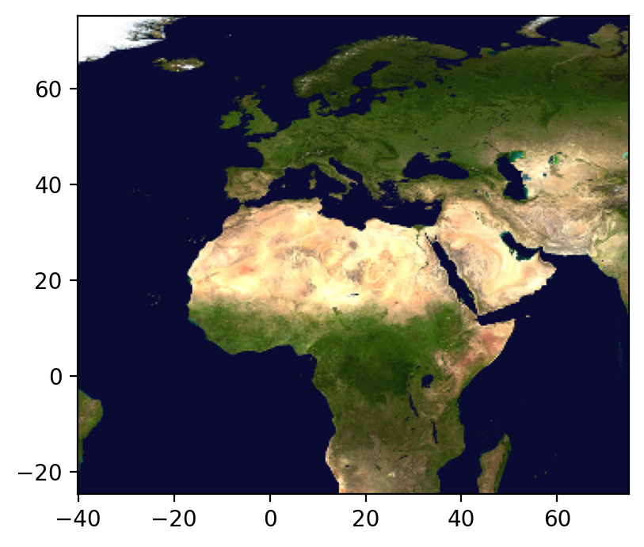
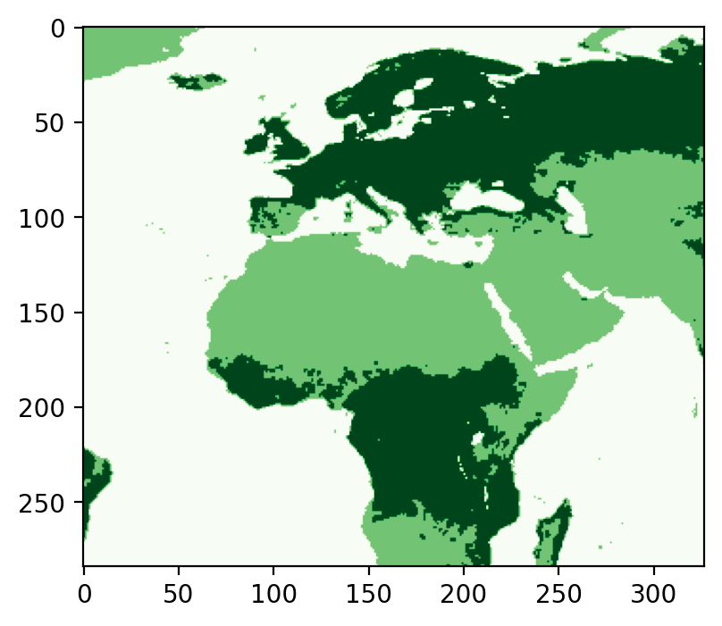
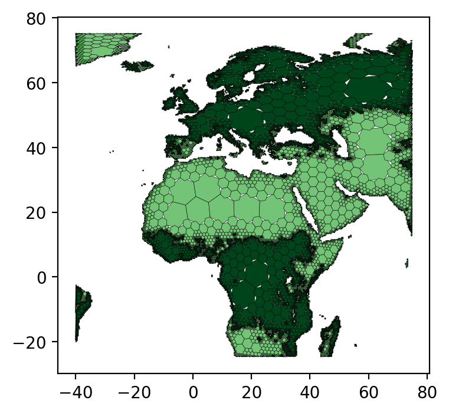
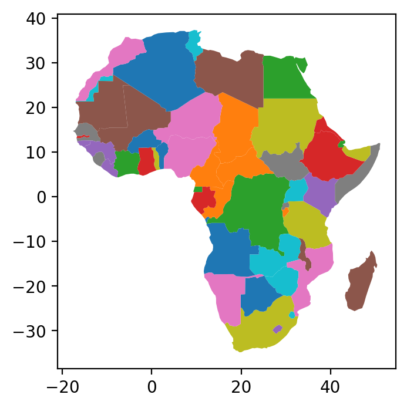
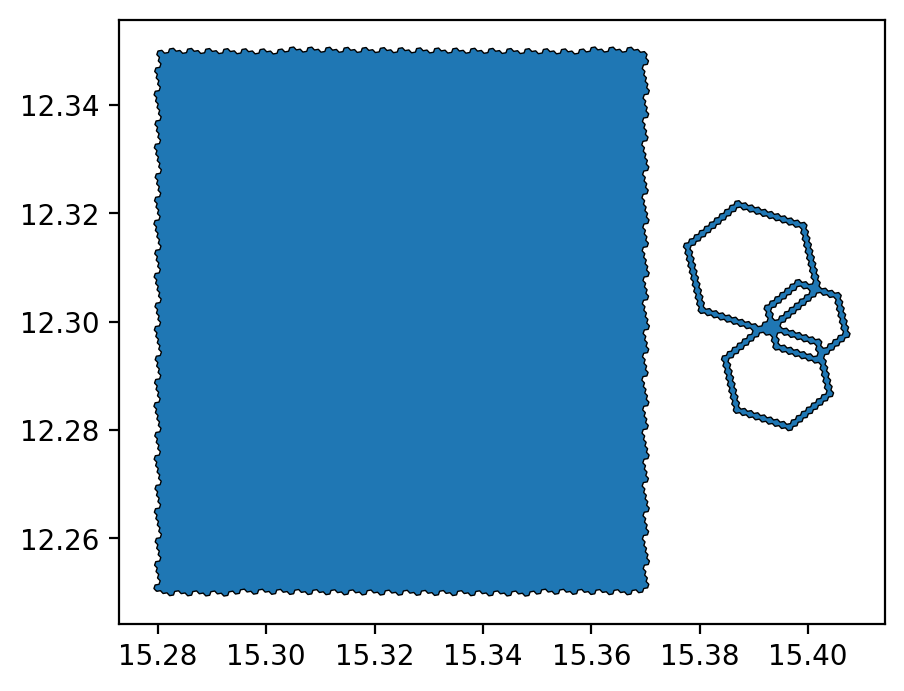
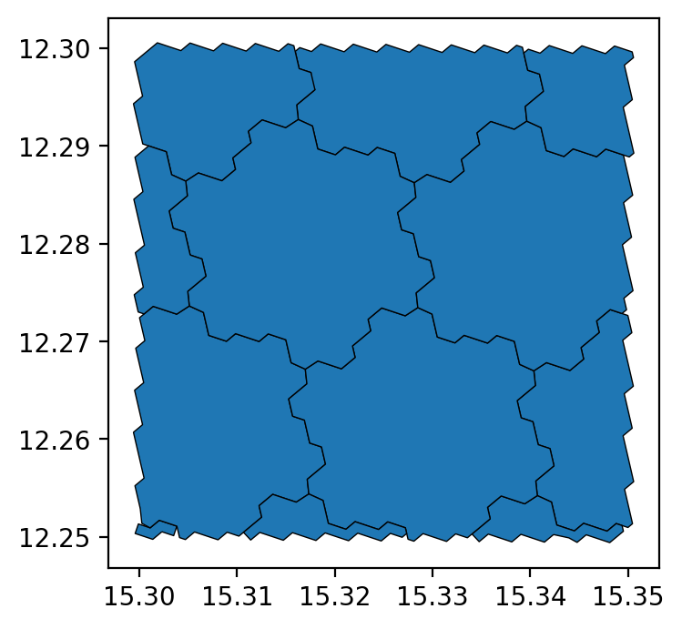

# `h3ronpy`

[](https://pypi.python.org/pypi/h3ronpy/)

Python extension for the [H3](https://h3geo.org) geospatial indexing system exposing some functionalities of the `h3ron*` rust crates to the python language and integrating with the [numpy](https://numpy.org/), [pandas](https://pandas.pydata.org/),
[geopandas](https://geopandas.org/), [rasterio](https://rasterio.readthedocs.io/en/latest/) and [gdal](https://gdal.org/) libraries. 

One goal is to not duplicate any functions already implemented by the [official H3 python bindings](https://github.com/uber/h3-py).

This library is in parts parallelized using [rayon](https://github.com/rayon-rs/rayon). The number of threads can be controlled as 
described in [the rayon FAQ](https://github.com/rayon-rs/rayon/blob/master/FAQ.md#how-many-threads-will-rayon-spawn)


## Installation

### via PyPI

Currently only `manylinux_2_24` wheels and the source distribution is pushed to PyPi. Support for other platforms is [planned](https://github.com/nmandery/h3ron/issues/18) - PRs are welcome.

To install the `manylinux_2_24` wheels, a fairly recent version of `pip` is required. So in case `pip` only finds the source distribution, upgrade `pip` using

```
pip install --upgrade pip
```

### Building manually

To build this extension from source, you will need:

* Rust. Install the latest version using [rustup](https://rustup.rs/)
* A C compiler for the libh3 sources, for example `clang`
* `cmake`, and eventually `make`
* Python 3.x and the corresponding C headers
* The dependencies from the [requirements.dev.txt](./requirements.dev.txt) file.

On Ubuntu most system-level dependencies should be available after running rustup and 

```shell
sudo apt-get install cmake python3-dev build-essential clang
```

The build is done using [maturin](https://github.com/PyO3/maturin)

There are three main commands:

* `maturin publish` builds the crate into python packages and publishes them to pypi.
* `maturin build` builds the wheels and stores them in a folder (`../target/wheels` by default), but doesn't upload them. It's possible to upload those with [twine](https://github.com/pypa/twine).
* `maturin develop` builds the crate and installs it as a python module directly in the current virtualenv.

To build the extension just use the `maturin build --release` command for an optimized build.


## Logging

This library uses rusts [`log` crate](https://docs.rs/log) together with the [`env_logger` crate](https://docs.rs/env_logger). 
This means that logging to `stdout` can be  controlled via environment variables. Set `RUST_LOG` to `debug`, `error`, `info`, 
`warn`, or `trace` for the corresponding log output.

For more fine-grained logging settings, see the documentation of `env_logger`.


## Usage

The following sections depend on the libraries from the `requirements.documentation.txt` file being installed.


```python
# imports

from matplotlib import pyplot
import rasterio
from rasterio.plot import show
import numpy as np
import h3.api.numpy_int as h3
from scipy import ndimage
import geopandas as gpd

# increase the plot size
pyplot.rcParams['figure.dpi'] = 200
```

### Converting raster data to H3

#### Prepare a dataset using rasterio first


```python
src = rasterio.open("../data/europe-and-north-africa.tif")
print(src.colorinterp)

green = src.read(2)
blue = src.read(3)
print(green.shape)

show(src)
```

    (<ColorInterp.red: 3>, <ColorInterp.green: 4>, <ColorInterp.blue: 5>)
    (284, 327)


    

    


    <AxesSubplot:>


Do image processing, like this messy extraction and smoothing of the greenish pixels done here:


```python
vegetation_mask = (green < 250) & (blue < 50)
ocean_mask = (green >= 6) & (green <= 14) & (blue >= 47) & (blue <= 54)
vegetation_nodata_value = 0

vegetation = np.full(green.shape, 10, dtype="int8")
vegetation[ocean_mask] = vegetation_nodata_value
vegetation[vegetation_mask] = 20
#pyplot.imshow(vegetation, cmap='Greens')

# smooth a bit to remove single pixels
vegetation = ndimage.gaussian_filter(vegetation, sigma=.7)
vegetation[vegetation <= 5] = vegetation_nodata_value
vegetation[(vegetation > 0) & (vegetation < 15)] = 1
vegetation[vegetation >= 15] = 2
vegetation[ocean_mask] = vegetation_nodata_value

vegetation_plot_args = dict(cmap='Greens', vmin=0, vmax=2)

pyplot.imshow(vegetation, **vegetation_plot_args)
```


    <matplotlib.image.AxesImage at 0x7f6627843ac0>


    

    


```python
vegetation
```


    array([[1, 1, 1, ..., 0, 0, 0],
           [1, 1, 1, ..., 0, 0, 0],
           [1, 1, 1, ..., 0, 0, 0],
           ...,
           [0, 0, 0, ..., 0, 0, 0],
           [0, 0, 0, ..., 0, 0, 0],
           [0, 0, 0, ..., 0, 0, 0]], dtype=int8)


#### Convert the raster numpy array to H3

Find the h3 resolution to use. See also the docstrings of the used functions and of the `h3ronpy.raster` module.


```python
from h3ronpy.raster import nearest_h3_resolution

h3_res = nearest_h3_resolution(vegetation.shape, src.transform, search_mode="smaller_than_pixel")
print(f"Using H3 resolution {h3_res}")
```

    Using H3 resolution 5


#### ... directly into a pandas (geo-)dataframe:


```python
from h3ronpy.raster import raster_to_dataframe

print("conversion start")
vegetation_h3_df = raster_to_dataframe(vegetation, src.transform, h3_res, nodata_value=vegetation_nodata_value, compacted=True, geo=True)
print("conversion done")

print("plotting ... this may take a bit")
vegetation_h3_df.plot(column="value", linewidth=0.2, edgecolor="black", **vegetation_plot_args)
pyplot.show()
```

    conversion start
    conversion done
    plotting ... this may take a bit


    

    


#### Using GDAL instead of rasterio

To not repeat any steps from above, we just save the processed data using `rasterio` and load it again using `gdal`.


```python
# ... TBW ...
```

### Convert vectordata to H3 indexes

The conversion of GeoDataFrames is parallelized using the available CPUs.


```python
import geopandas as gpd
from h3ronpy import vector, util

world = gpd.read_file(gpd.datasets.get_path('naturalearth_lowres'))
africa = world[world["continent"] == "Africa"]
africa.plot(column="name")

# convert to h3 cells and build a new geodataframe
gdf = util.h3index_column_to_geodataframe(vector.geodataframe_to_h3(africa, 3))
gdf.plot(column="name")
```


    <AxesSubplot:>


    

    


    

    


### Converting H3 indexes to vector geometries

The main functionality already exists with the `LinkedPolygons` in the H3 library itself. This library here just integrates this and adds some polish - like the smoothing - around it.

Additionally the polygon objects implement the [python geo interface](https://gist.github.com/sgillies/2217756), so they are compatible to most mapping libraries - see the geopandas plotting below.


```python
from h3ronpy import Polygon

squares_and_rings = np.concatenate([
    h3.hex_ring(h3.geo_to_h3(12.3, 15.4, 10), 6),
    h3.hex_ring(h3.geo_to_h3(12.31, 15.39, 10), 10),
    h3.hex_ring(h3.geo_to_h3(12.29, 15.395, 10), 8),
    h3.polyfill_polygon([
        (12.25, 15.28),
        (12.25, 15.37),
        (12.35, 15.37),
        (12.35, 15.28), 
        (12.25, 15.28)
    ], 10, lnglat_order=False)
])
sqr_geoms = Polygon.from_h3indexes(squares_and_rings) # returns a list of polygons
gpd.GeoDataFrame({}, geometry=sqr_geoms).plot(edgecolor="black", linewidth=0.5)
```


    <AxesSubplot:>


    

    


For a cleaner look, the generated vector geometries can also be smoothed using a variation of [Chaikins smoothing algorithm](http://www.idav.ucdavis.edu/education/CAGDNotes/Chaikins-Algorithm/Chaikins-Algorithm.html). This includes a non-destructive simplification where the number of vertices gets reduced.


```python
sqr_smoothed = Polygon.from_h3indexes(squares_and_rings, smoothen=True)
gpd.GeoDataFrame({}, geometry=sqr_smoothed).plot(edgecolor="black", linewidth=0.5)
```


    <AxesSubplot:>


    

    


There is also the `align_to_h3_resolution` variant of this which will generate polygons not exceeding the area of a given parent resolution.

Corners will be aligned to the corners of the parent resolution when they are less than an
edge length away from them. This is to avoid gaps when `smoothen` is set to true.


```python
box_indexes = h3.polyfill_polygon([
        (12.25, 15.30),
        (12.25, 15.35),
        (12.30, 15.35),
        (12.30, 15.30), 
        (12.25, 15.30)
], 10)

 # aling the geometries to h3 resolution 2 where complete edges touch. This reduced the number of vertices 
# a fair amount
box_aligned_geoms = Polygon.from_h3indexes_aligned(box_indexes, 7, smoothen=True)
gpd.GeoDataFrame({}, geometry=box_aligned_geoms).plot(edgecolor="black", linewidth=0.5)
```


    <AxesSubplot:>


    

    

